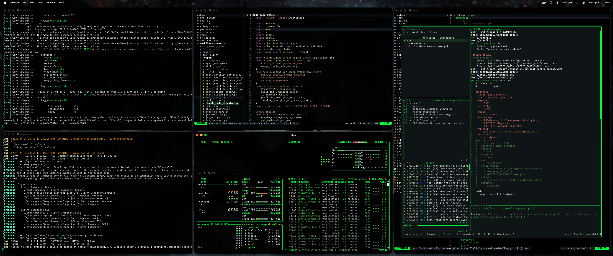
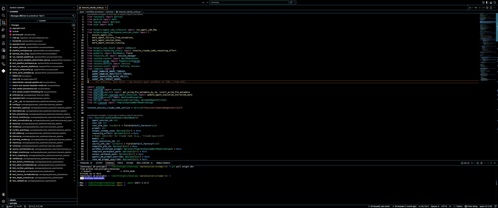

# dotfiles

Personal macOS dotfiles for a terminal-first setup built around:

- Neovim with a VS Code-like workflow
- Ghostty with a matching black-and-fluorescent-green shell
- btop themed to match the terminal and editor
- LazyGit and Neovide config kept in the same repo

## Screenshots

### Full shell overview



### Neovim workspace



## What is in here

### Neovim

- pinned file tree on the left
- centered bordered search overlays
- `snacks.nvim` for search, command history, notifications, and LazyGit
- `blink.cmp` completion with simple tab behavior
- native LSP with project-aware Python, Node, Rust, and Go detection
- format on save with `conform.nvim`
- VS Code-style shortcuts where terminal-safe

### Terminal

- Ghostty with a black background, fluorescent-green accents, and subtle translucency
- btop with a matching custom theme
- LazyGit with mouse support enabled

## Repo layout

```text
.
├── btop/
├── docs/
├── ghostty/
├── lazygit/
├── neovide/
└── nvim/
```

## Install

### 1. Clone

```bash
git clone https://github.com/rootsec1/dotfiles.git ~/.dotfiles
cd ~/.dotfiles
```

### 2. Install dependencies

```bash
brew install neovim ghostty lazygit btop ripgrep fd fzf stylua shfmt
brew install node
brew install font-fira-code-nerd-font
pip install ruff
npm install -g prettier pyright typescript typescript-language-server yaml-language-server vscode-langservers-extracted @tailwindcss/language-server
```

If you use `nvm`, make sure a default Node version is set so `node` and `npm` are available in Neovim too.

### 3. Link configs

```bash
mkdir -p ~/.config

ln -sfn ~/.dotfiles/nvim ~/.config/nvim
ln -sfn ~/.dotfiles/ghostty ~/.config/ghostty
ln -sfn ~/.dotfiles/lazygit ~/.config/lazygit
ln -sfn ~/.dotfiles/neovide ~/.config/neovide
ln -sfn ~/.dotfiles/btop ~/.config/btop
```

### 4. Start the apps

```bash
nvim
ghostty
btop
```

## Neovim keys

### Search and navigation

- `Ctrl-p` file search
- `Ctrl-f` search in current file
- `Space f` workspace search
- `Space s` search hub
- `Ctrl-b` toggle file tree
- `Space b` switch buffers
- `Space p` command palette

### Editing

- `Ctrl-s` save
- `Ctrl-z` undo
- `Ctrl-y` redo
- `Ctrl-d` duplicate line
- `Ctrl-/` toggle comment
- `Tab` / `Shift-Tab` next and previous tab
- `Ctrl-w` close current tab

### LSP

- `K` hover
- `gd` or `F12` go to definition
- `gr` or `Shift-F12` references
- `F2` rename
- `Space .` code actions
- `Space d` diagnostics

### Git

- `Space g` LazyGit
- `Space g s` git status picker
- `Space g l` git log picker
- `Space g o` open current git file in browser

## Project-aware language support

The LSP setup automatically picks up local project context:

- Python: `.venv`, `venv`, or `env`
- Node: `package.json`, lockfiles, local `node_modules`, workspace TypeScript SDK
- Rust: `Cargo.toml` or `rust-project.json`
- Go: `go.mod` or `go.work`

That means imports resolve against the current project instead of only the global shell.

## Validation

Run the editor checks with:

```bash
nvim --headless . '+luafile nvim/scripts/smoke_test.lua' +qa
nvim --headless . '+luafile nvim/scripts/e2e_flow_suite.lua' +qa
```

## Notes

- Markdown uses regex highlighting on purpose because of a Neovim 0.12 Treesitter redraw crash path.
- External file changes are auto-reloaded for clean buffers.
- Ghostty translucency is intentionally subtle so text stays readable.

More detail lives in:

- `docs/spec-nvim-revamp.md`
- `docs/spec-terminal-theme.md`
- `docs/workflows/nvim-editor.md`
- `docs/workflows/terminal-theme.md`
